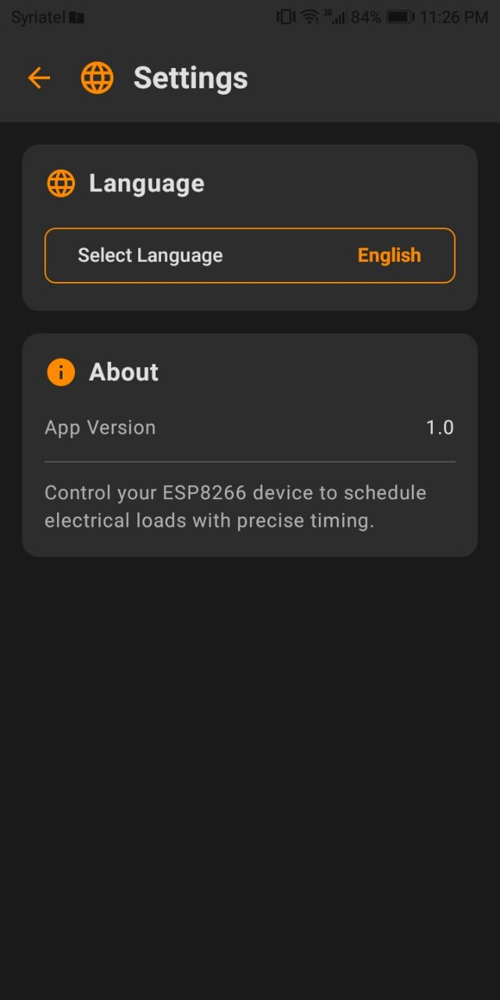
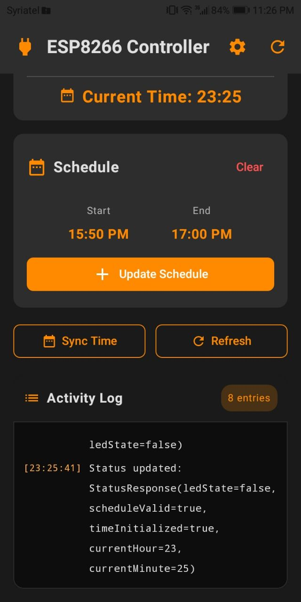
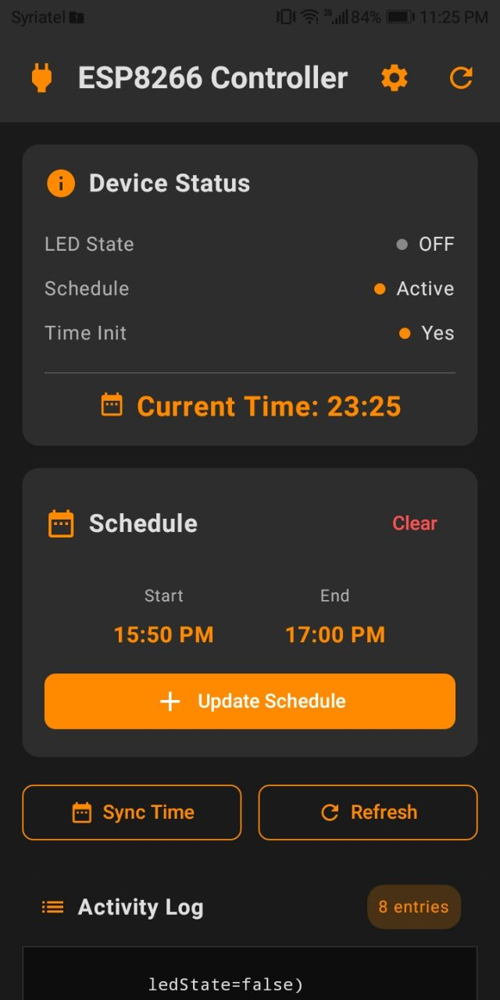

# ⏰ ESP8266 Load Timer

<div align="center">


**Smart IoT solution for scheduling electrical loads with precision timing**

[Features](#-features) • [Demo](#-demo) • [Setup](#-setup) • [Usage](#-usage) • [API](#-api-reference)

</div>

---

## 📖 Overview

ESP8266 Load Timer is a complete IoT solution that allows you to control electrical devices on a schedule using an ESP8266 microcontroller and an Android app. Perfect for automating lights, fans, water pumps, or any electrical load based on time schedules.

### 🎯 Key Highlights

- **📱 Beautiful Android App** - Modern Material 3 UI with dark theme
- **🌍 Bilingual Support** - Full English and Arabic localization with RTL support
- **⚡ Real-time Control** - Instant schedule updates via WiFi
- **💾 Persistent Storage** - Schedules saved to EEPROM, survives power cycles
- **🌐 Web Interface** - Control from any device with a web browser
- **🔒 Offline Operation** - No internet required, works on local WiFi

---

## ✨ Features

### Android App
- ✅ **Intuitive Schedule Management** - Set start and end times with AM/PM format
- ✅ **Real-time Status Monitoring** - View device state, schedule status, and current time
- ✅ **Activity Logging** - Track all operations with timestamped logs
- ✅ **Time Synchronization** - Automatic time sync from phone to ESP8266
- ✅ **Multi-language** - Switch between English and Arabic seamlessly
- ✅ **Settings Page** - Configure language preferences and view app info
- ✅ **Modern UI** - Orange accent theme with smooth animations

### ESP8266 Firmware
- ✅ **WiFi Access Point** - Creates its own WiFi network for easy connection
- ✅ **RESTful API** - JSON-based API for mobile app integration
- ✅ **Web Dashboard** - Responsive HTML interface for browser control
- ✅ **EEPROM Storage** - Persistent schedule storage
- ✅ **Midnight Crossing** - Handles schedules that span across midnight
- ✅ **Automatic Execution** - Turns load on/off based on schedule

---

## 🎬 Demo

### Android App Screenshots

<table>
  <tr>
    <td align="center"><b>Settings Screen (English)</b></td>
    <td align="center"><b>Main Screen (English)</b></td>
    <td align="center"><b>Main Screen </b></td>
  </tr>
  <tr>
    <td></td>
    <td></td>
    <td></td>
  </tr>
  <tr>
    <td>
      • Language selection<br>
      • App information<br>
      • Version details<br>
    </td>
    <td>
      • Activity Logging<br>
    </td>
    <td>
      • Time Synchronization<br>
      • Set Schedule<br>
      • Turn Load On/Off<br>
    </td>
  </tr>
</table>

### Web Interface

Access the ESP8266 web dashboard by connecting to the WiFi network and navigating to `http://192.168.4.1`

---

## 🚀 Setup

### Hardware Requirements

- **ESP8266** (NodeMCU, Wemos D1 Mini, or similar)
- **Relay Module** (for controlling AC loads)
- **Power Supply** (5V for ESP8266)
- **Electrical Load** (light, fan, pump, etc.)

### Wiring Diagram

```
ESP8266 GPIO2 (D4) ──→ Relay IN
Relay COM ──→ Load (Live wire)
Relay NO ──→ AC Power (Live)
```

⚠️ **Safety Warning**: Working with AC power can be dangerous. If you're not experienced with electrical work, consult a professional electrician.

### Software Requirements

#### For ESP8266:
- Arduino IDE (1.8.x or later)
- ESP8266 Board Package
- Required Libraries:
  - ESP8266WiFi
  - ESP8266WebServer
  - EEPROM

#### For Android App:
- Android Studio (latest version)
- Android SDK 24 or higher
- Kotlin 1.9+

---

## 📥 Installation

### 1. ESP8266 Firmware

1. **Install Arduino IDE** and add ESP8266 board support:
   - Go to `File` → `Preferences`
   - Add to Additional Board Manager URLs:
     ```
     http://arduino.esp8266.com/stable/package_esp8266com_index.json
     ```
   - Go to `Tools` → `Board` → `Boards Manager`
   - Search for "ESP8266" and install

2. **Upload the firmware**:
   ```bash
   # Open esp8266/ESP.cpp in Arduino IDE
   # Select your ESP8266 board (e.g., NodeMCU 1.0)
   # Select the correct COM port
   # Click Upload
   ```

3. **Configure WiFi credentials** (optional):
   ```cpp
   const char* ap_ssid = "ESP_HOTSPOT";  // Change if desired
   const char* ap_pass = "12345678";     // Change if desired
   ```

### 2. Android App

1. **Clone the repository**:
   ```bash
   git clone https://github.com/Janadasroor/Electric-Load-Timer.git
   cd Electric-Load-Timer
   ```

2. **Open in Android Studio**:
   - Open Android Studio
   - Select "Open an Existing Project"
   - Navigate to the cloned directory
   - Wait for Gradle sync to complete

3. **Configure ESP8266 IP** (if different):
   - Open `app/src/main/java/com/example/loadtimeresp/data/api/NetworkModule.kt`
   - Update the base URL if needed (default: `http://192.168.4.1`)

4. **Build and install**:
   ```bash
   ./gradlew assembleDebug
   # Or use Android Studio's "Run" button
   ```

---

## 📱 Usage

### Quick Start

1. **Power on the ESP8266**
   - The device creates a WiFi network named `ESP_HOTSPOT`

2. **Connect your phone**
   - WiFi: `ESP_HOTSPOT`
   - Password: `12345678`

3. **Open the Android app**
   - Grant WiFi and location permissions
   - The app will automatically connect to the ESP8266

4. **Set a schedule**
   - Tap "Set Schedule"
   - Choose start time (e.g., 8:00 AM)
   - Choose end time (e.g., 6:00 PM)
   - Tap "Set"

5. **Monitor operation**
   - View real-time status
   - Check activity logs
   - Verify schedule is active

### Web Interface Usage

1. Connect to `ESP_HOTSPOT` WiFi
2. Open browser and go to `http://192.168.4.1`
3. The page will auto-sync time from your device
4. Set schedule using the web form
5. Monitor LED status in real-time

### Changing Language

1. Tap the Settings icon (⚙️) in the top bar
2. Tap "Select Language"
3. Choose English or Arabic (العربية)
4. App will restart with new language

---

## 🔌 API Reference

### Base URL
```
http://192.168.4.1
```

### Endpoints

#### 1. Sync Time
```http
POST /syncTime
Content-Type: application/x-www-form-urlencoded

hour=14&minute=30&second=0
```

**Response:**
```json
{}
```

#### 2. Set Schedule
```http
POST /setSchedule
Content-Type: application/x-www-form-urlencoded

startHour=8&startMin=0&startPeriod=AM&endHour=6&endMin=0&endPeriod=PM
```

**Response:**
```json
{}
```

#### 3. Get Schedule (JSON)
```http
GET /getSchedule/json
```

**Response:**
```json
{
  "valid": true,
  "startHour": 8,
  "startMinute": 0,
  "endHour": 18,
  "endMinute": 0,
  "startPeriod": "AM",
  "endPeriod": "PM",
  "timeInitialized": true,
  "currentHour": 14,
  "currentMinute": 30,
  "ledState": true
}
```

#### 4. Get Status
```http
GET /status
```

**Response:**
```json
{
  "ledState": true,
  "scheduleValid": true,
  "timeInitialized": true,
  "currentHour": 14,
  "currentMinute": 30
}
```

#### 5. Clear Schedule
```http
POST /clearSchedule
```

**Response:**
```json
{}
```

---

## 🏗️ Architecture

### System Overview

```
┌─────────────────┐         WiFi          ┌──────────────────┐
│  Android App    │◄─────────────────────►│   ESP8266        │
│  (Jetpack       │     HTTP/REST API     │   (Access Point) │
│   Compose)      │                       │                  │
└─────────────────┘                       └────────┬─────────┘
                                                   │
                                                   │ GPIO
                                                   ▼
                                          ┌─────────────────┐
                                          │  Relay Module   │
                                          └────────┬────────┘
                                                   │
                                                   ▼
                                          ┌─────────────────┐
                                          │ Electrical Load │
                                          │ (Light/Fan/etc) │
                                          └─────────────────┘
```

### Android App Stack

- **UI**: Jetpack Compose with Material 3
- **Architecture**: MVVM (Model-View-ViewModel)
- **Dependency Injection**: Hilt
- **Networking**: Retrofit + OkHttp
- **Storage**: DataStore Preferences
- **Navigation**: Navigation Compose
- **Localization**: Android Resources (values/values-ar)

### ESP8266 Stack

- **Framework**: Arduino
- **Web Server**: ESP8266WebServer
- **Storage**: EEPROM
- **Time Management**: millis() based tracking
- **WiFi Mode**: Access Point (AP)

---

## 🛠️ Development

### Project Structure

```
LoadTimerESP/
├── app/                          # Android application
│   └── src/main/
│       ├── java/com/example/loadtimeresp/
│       │   ├── data/            # Data layer
│       │   │   ├── api/         # API service & models
│       │   │   ├── datastore/   # Settings persistence
│       │   │   └── repositories/# Data repositories
│       │   ├── presentation/    # UI layer
│       │   │   ├── navigation/  # Navigation setup
│       │   │   ├── screens/     # Composable screens
│       │   │   └── viewmodels/  # ViewModels
│       │   ├── ui/theme/        # Theme & styling
│       │   └── utils/           # Utilities
│       └── res/
│           ├── values/          # English strings
│           └── values-ar/       # Arabic strings
│
└── esp8266/
    └── ESP.cpp                  # ESP8266 firmware
```

### Building from Source

```bash
# Clone repository
git clone https://github.com/Janadasroor/Electric-Load-Timer.git
cd Electric-Load-Timer

# Build Android app
./gradlew assembleDebug

# APK will be in: app/build/outputs/apk/debug/
```

### Contributing

Contributions are welcome! Please feel free to submit a Pull Request.

1. Fork the repository
2. Create your feature branch (`git checkout -b feature/AmazingFeature`)
3. Commit your changes (`git commit -m 'Add some AmazingFeature'`)
4. Push to the branch (`git push origin feature/AmazingFeature`)
5. Open a Pull Request

---

## 🐛 Troubleshooting

### ESP8266 won't create WiFi network
- Check power supply (needs stable 5V)
- Verify firmware uploaded successfully
- Check serial monitor for error messages

### Android app can't connect
- Ensure phone is connected to `ESP_HOTSPOT` WiFi
- Grant all required permissions (WiFi, Location)
- Check ESP8266 IP is `192.168.4.1`
- Disable mobile data while testing

### Schedule not working
- Ensure time is synchronized (tap "Sync Time")
- Verify schedule is set correctly
- Check serial monitor for ESP8266 logs
- Confirm schedule doesn't have invalid times

### Language not changing
- Ensure you tap "Set" after selecting language
- App should restart automatically
- Check Settings → Language to verify selection

---

## 📄 License

This project is licensed under the MIT License - see the [LICENSE](LICENSE) file for details.

---

## 👨‍💻 Author

**Janada Sroor**
- GitHub: [@JanadaSroor](https://github.com/JanadaSroor)
- LinkedIn: [Janada Sroor](https://www.linkedin.com/in/janada-sroor?utm_source=share&utm_campaign=share_via&utm_content=profile&utm_medium=android_app)

---

## 🙏 Acknowledgments

- ESP8266 Community for excellent documentation
- Jetpack Compose team for modern Android UI toolkit
- Material Design 3 for beautiful design guidelines
- All contributors and testers

---

## 🌟 Star History

If you find this project useful, please consider giving it a ⭐!

---

